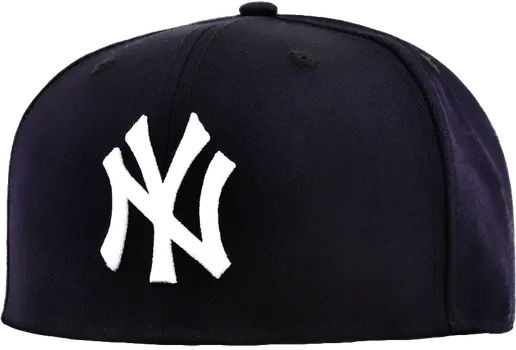

# About Me

Hello, I'm Mez. I spent a week creating my first "Hello, World!" program in C.
It's not due to my lack of skill, no siree. It's because uhh...

## Detailed Info

| Name       | Value
| -----------| -----------
| Real Name  | Real Mez
| Language   | Anything as long as i'm allowed to use search engine
| Tools      | Akimbo Heather Submachine Guns: TBTB Suppressors, +4 Stability, Compact Laser Module, Unfolded Stock

## Yankee With No Brim

> **Fig.1** Yankee with no brim
